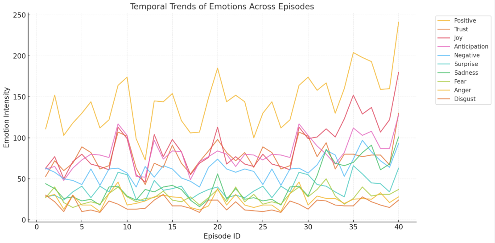

# Emily in Paris Season 5: Descriptive and Predictive Analytics

## Project Overview
This project uses descriptive and predictive analytics to inform the development of *Emily in Paris* Season 5. 

### Business Understanding
We sought to address the following key questions:
- What are the dominant themes and sentiments expressed by the audience?
- How have viewer opinions changed over time?
- What factors influence positive or negative sentiment?

### Data Collection and Analysis
We collected data from *Emily in Paris* show transcripts to perform sentiment analysis and topic modeling.  
- **Word Cloud**: We generated a Word Cloud to visualize the show's key themes. *(INSERT WORD CLOUD IMAGE HERE)*  
- **Sentiment Analysis**: Initial sentiment analysis revealed limited actionable insights, prompting us to conduct emotional analysis.  

### Predictive Models
We applied several predictive models, including time series regression, to predict audience satisfaction as measured by IMDb ratings. Our most successful model was **Random Forest**, which provided strong predictive accuracy.

### Key Findings
1. **Emotions Driving Viewer Satisfaction**:
   - **Joy**, **trust**, and **surprise** were the primary emotions shaping viewer satisfaction.
   - **Fear** and **suspense** were positively correlated with higher ratings, reflecting audience engagement.  
   - **Disgust** often indicated conflict and contributed to narrative tension.

2. **Themes and Sentiments**:
   - Topic modeling revealed recurring themes and helped identify key areas for narrative enhancement.  
   - Emotional analysis provided a nuanced understanding of audience responses, highlighting the complex interplay of emotions with ratings.

### Conclusion
By leveraging descriptive and predictive analytics, we uncovered insights into the emotional and thematic elements that resonate most with viewers. These findings can guide storytelling decisions for *Emily in Paris* Season 5, enhancing audience satisfaction and ratings.

---

## Technologies Used
- **Data Collection**: Show transcripts
- **Descriptive Analytics**: Word Cloud, sentiment analysis, topic modeling
- **Predictive Analytics**: Random Forest, time series regression
- **Metrics**: IMDb ratings as the success criterion

## Future Work
- Explore additional datasets, such as social media comments or reviews.
- Refine predictive models to incorporate more contextual features.
- Develop actionable recommendations for future seasons based on insights.

---

## Contact
For more details, feel free to reach out or explore the code repository.
